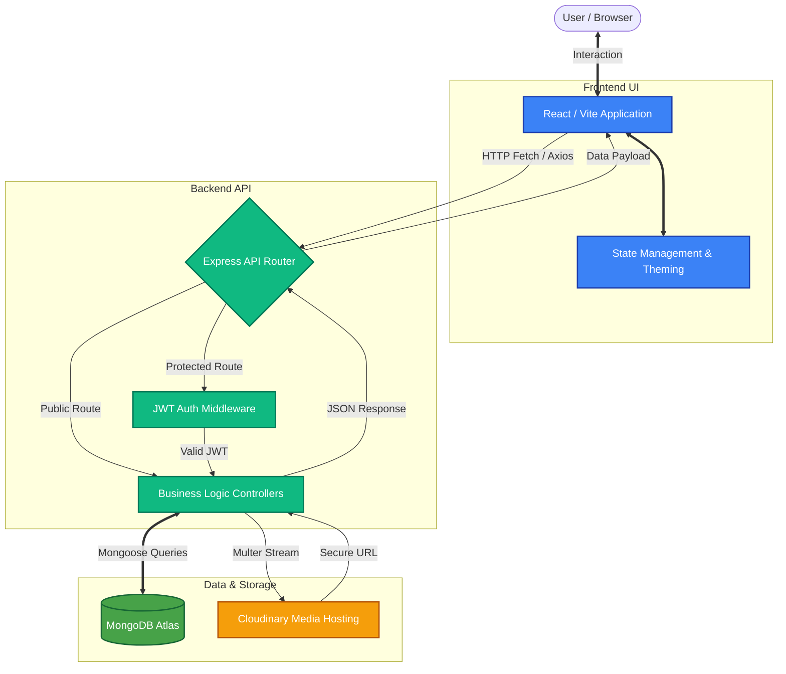

<div align="center">
  
  
  # Bikers Unity Calls (BUC) India
  
  **India's Premier Riding Community**
  
  <p align="center">
    
    
    
    
    
    
    
  </p>

  <p>
    A heavy-duty MERN stack web application built to manage, connect, and inspire the largest motorcycle community in India.
  </p>
</div>

--- 

## 🏍️ Overview

Bikers Unity Calls (BUC) is a full-stack platform designed to facilitate group riding, community forums, event registrations, and club management. The frontend leverages a highly polished, **Material Design 3 (M3)** aesthetic with a premium dark mode, smooth glassmorphism, and seamless GSAP micro-animations. The backend is a robust REST API powered by Express and MongoDB.

---

## ✨ Key Features

### 🌐 Frontend (User Experience)
* **Tesla/Apple Minimalist Aesthetic**: A polished, premium UI with 90px headers, pill-based navigation, deep ambient gradients, and frosted glass components.
* **Google Metallic UI Auth**: Clean, high-conversion Login, Signup, and Registration dialogs standardizing the entry flow.
* **Responsive Material Grids**: Completely responsive layout adapting gracefully from mobile (`xs`) to ultrawide desktops (`lg`) utilizing MUI's v2 Grid system.
* **Dynamic Media Gallery**: 1:1 aspect ratio square grids displaying community videos and photos.
* **Public & Private Pages**: Forum, Clubs, Safety Guidelines, Events, Member Directory, and secure user Profiles.
* **GSAP Integrations**: Smooth scrolling to anchor links and split-text revealing animations on entry headers.

### ⚙️ Backend (Architectural Power)
* **Secure Authentication**: JWT-based authentication combined with bcrypt hashing for secure session management.
* **Event & Registration Engine**: Handles highly concurrent event signups, participant management, and validation.
* **Admin Dashboard Platform**: Dedicated protected routes for Admins to interact with DataGrids monitoring Memberships, Gallery Uploads, and Club modifications.
* **Cloudinary Media Storage**: Seamless `multer-storage-cloudinary` integration to securely offload media files.

---

## 🛠️ Tech Stack

| Domain | Technology | Description |
|---|---|---|
| **Frontend** | React, Vite | Core view library and lightning-fast bundler |
| **Styling** | Material-UI (MUI), GSAP | M3 design system, responsive grids, scroll animations |
| **Backend** | Node.js, Express.js (v5) | Server runtime and minimal web framework |
| **Database** | MongoDB, Mongoose | NoSQL database and schema modeling |
| **Security** | JWT, bcryptjs, CORS | Token authentication and password encryption |
| **Storage** | Cloudinary, Multer | File parsing and cloud asset hosting |

---

## 🔄 Application Workflow

The BUC India platform operates on a modernized client-server MERN architecture. Here is the step-by-step data flow and interaction model:



1. **User Interaction (Frontend)**: 
   - A user visits the React/Vite frontend. The high-performance UI is instantly delivered, featuring dynamic routing and fluid UI components.
2. **State & Theming**:
   - The entire visual experience is wrapped in a Material-UI (MUI) `ThemeProvider`, mapping out the dark slate aesthetic and blue accent colors (`theme.js`). 
   - State management handles authentication checks, utilizing JWT tokens stored securely to distinguish between Public, Member, and Admin views.
3. **API Requests**:
   - When a user performs a secure action (e.g., Registers for an Event, Logs in, or Uploads Media), the frontend dispatches an asynchronous HTTP request to the Node/Express backend environment (`/api/...`).
4. **Backend Processing & Security**:
   - The Express server intercepts the request using specific modular routes (`eventRoutes.js`, `authRoutes.js`, etc.).
   - Protected routes execute Middleware authentication to ensure the request contains a valid JSON Web Token (JWT).
   - If an image or media asset is uploaded, `multer` parses the multipart form data and streams it directly to **Cloudinary** using `multer-storage-cloudinary`.
5. **Database Transactions (MongoDB)**:
   - The specific Controller function processes the validated data and executes `Mongoose` queries to read or write to the MongoDB cluster. Crucial data like passwords are concurrently hashed via `bcryptjs`.
6. **Response & UI Update**:
   - The backend responds with standardized JSON indicating operation success or failure. The frontend intercepts the payload, triggers dynamic Success Dialogs or Snackbars, and seamlessly updates the local UI state without page reloads.

---

## �🚀 Getting Started

### Prerequisites
* Node.js v18+
* MongoDB URI (Local or Atlas)
* Cloudinary Account (for media uploads)

### 1. Clone the Repository
```bash
git clone https://github.com/your-username/buc-india.git
cd buc-india
```

### 2. Backend Setup
```bash
cd Backend
npm install
```
Create a `.env` file in the `Backend` directory:
```env
PORT=5000
MONGODB_URI=your_mongo_connection_string
JWT_SECRET=your_jwt_secret
FRONTEND_URL=http://localhost:5173
CLOUDINARY_CLOUD_NAME=your_cloud_name
CLOUDINARY_API_KEY=your_api_key
CLOUDINARY_API_SECRET=your_api_secret
ADMIN_USERNAME=admin
ADMIN_PASSWORD=Admin@bucindia@2026
```
Start the backend development server:
```bash
npm run dev
```
*(The server will boot up on http://localhost:5000)*

### 3. Frontend Setup
```bash
cd ../Frontend
npm install
```
Create a `.env` file in the `Frontend` directory:
```env
VITE_API_URL=http://localhost:5000/api
```
Start the Vite development server:
```bash
npm run dev
```

---

## 📁 Directory Structure

```text
buc_india/
├── Backend/
│   ├── controllers/      # Route logic and database ops
│   ├── middleware/       # JWT verification, upload handlers
│   ├── models/           # Mongoose schemas (User, Event, etc.)
│   ├── routes/           # Express API endpoints
│   └── server.js         # Entry point and Express configuration
├── Frontend/
│   ├── public/           # Static assets
│   └── src/
│       ├── assets/       # Media, local photos/videos
│       ├── components/   # React components (MUI implementations)
│       │   ├── Admin*/   # Protected dashboard components  
│       │   ├── Clubs/    # Club ecosystem UI
│       │   └── animations/# GSAP and Framer utility wrappers
│       ├── App.jsx       # Root router and layout wrapper
│       ├── main.jsx      # React DOM entry and ThemeProvider
│       └── theme.js      # Global Material Design configuration
└── README.md
```

---

## 🤝 Contributing
Contributions, issues, and feature requests are welcome! 
If you plan to modify components, please adhere to the **Material Design 3** strict styling (`theme.js` globals) and avoid inline Tailwind utilities for consistency.

## 📄 License
This project is licensed under the MIT License - see the LICENSE file for details.

<div align="center">
  <sub>Built with ❤️ by Cortex IT Team.</sub>
</div>
